# Lab 04: Streaming Data Processing with Spark

## Lab requirements

The main purpose of this lab is to learn how to use Spark to process streaming data. In this lab, we will use Spark to process streaming data from a Kafka topic. The data is a stream of tweets from Twitter. We will use Spark to process the data and perform sentiment analysis on the tweets.

First, we need the Twitter tweets data.

## Get the Twitter tweets

We will use crawled data of tweets in [ChatGPT-Tweets](https://huggingface.co/datasets/deberain/ChatGPT-Tweets). The easiest way to download the date is using `wget` command.

```python
!wget -O tweets.parquet https://huggingface.co/datasets/deberain/ChatGPT-Tweets/resolve/main/data/train-00000-of-00001-c77acc9ef8da1d50.parquet
```

Now we have the tweets data in `tweets.parquet` file. Let's store it in MongoDB. But we need to install `mongodb` first.

```python
!apt install -qq mongodb
!service mongodb start
```

We will use `pymongo` to connect to MongoDB and store the tweets data.

```python
!pip install pymongo
```

Let's create a dummy datebase to test (refer to Instructor Doan Dinh Toan's strategy).

```python
from pymongo import MongoClient
client = MongoClient()

db = client['dummy']
db['chunks'].insert_many([{'Banh xeo': 'Rat ngon'},{'Banh bao': 'Cung ngon'}])

client.list_database_names()
```

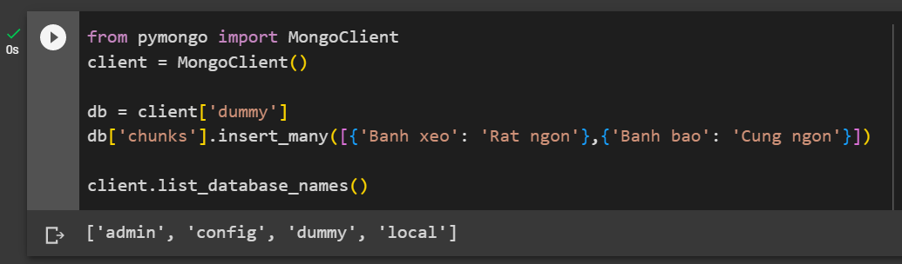

Now let's install Spark and PySpark.

```python
!apt-get install openjdk-8-jdk-headless -qq > /dev/null
!wget https://downloads.apache.org/spark/spark-3.4.0/spark-3.4.0-bin-hadoop3.tgz
!tar -xf spark-3.4.0-bin-hadoop3.tgz
!pip install findspark
```

Set the environment variables.

```python
import os
os.environ["JAVA_HOME"] = "/usr/lib/jvm/java-8-openjdk-amd64"
os.environ["SPARK_HOME"] = "spark-3.4.0-bin-hadoop3"
os.environ['PYSPARK_SUBMIT_ARGS'] = '--packages org.apache.spark:spark-sql-kafka-0-10_2.12:3.4.0,org.apache.kafka:kafka-clients:3.4.0,org.mongodb.spark:mongo-spark-connector_2.12:10.1.1 pyspark-shell'
```

In `PYSPARK_SUBMIT_ARGS` variable, we have added three different packages:

- `org.apache.spark:spark-sql-kafka-0-10_2.12:3.4.0` and `org.apache.kafka:kafka-clients:3.4.0` are used to connect to Kafka.
- `org.mongodb.spark:mongo-spark-connector_2.12:10.1.1` is used to connect to MongoDB.

Now let's import Spark and start a Spark session.

```python
import findspark
findspark.init()
import pyspark

from pyspark.shell import spark
from pyspark import SparkContext, SparkConf

uri = "mongodb://localhost:27017/dummy"
from pyspark.sql import SparkSession

my_spark = SparkSession \
    .builder \
    .appName("csc14112") \
    .config("spark.mongodb.read.connection.uri", uri) \
    .config("spark.mongodb.write.connection.uri", uri) \
    .getOrCreate()
```

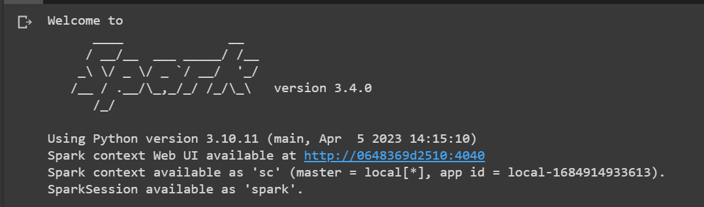

Let's read the tweets data from `tweets.parquet` file.

```python
tweets_df = my_spark.read.parquet("tweets.parquet")
tweets_df.head()
```

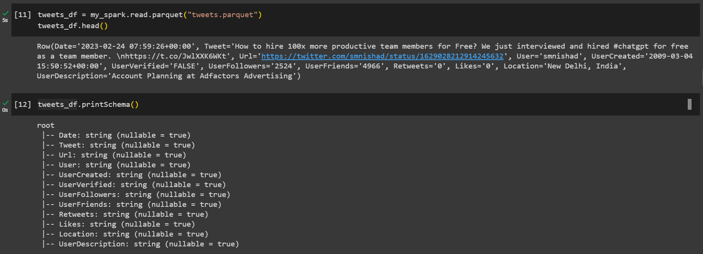

Finnaly, let's store the tweets data in MongoDB.

```python
tweets_df.write \
.format("mongodb") \
.option("database", "lab4") \
.option("collection", "tweets") \
.mode("overwrite") \
.save()
```

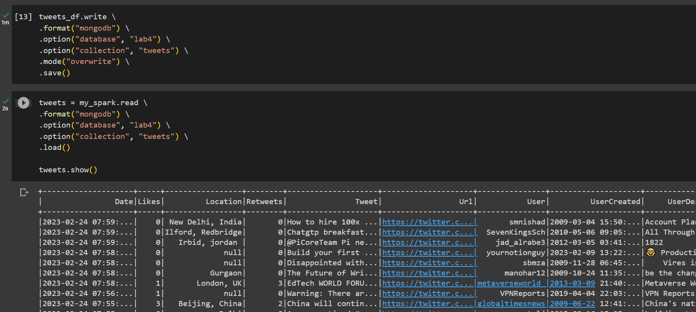

Next, meet Spark's old friend, Kafka.

## Stream tweets to Apache Spark

Install Kafka and kafka-python.

```python
!wget https://downloads.apache.org/kafka/3.4.0/kafka_2.12-3.4.0.tgz
!tar -xf kafka_2.12-3.4.0.tgz
!pip install kafka-python
```

Run the instances

```python
!./kafka_2.12-3.4.0/bin/zookeeper-server-start.sh -daemon ./kafka_2.12-3.4.0/config/zookeeper.properties
!./kafka_2.12-3.4.0/bin/kafka-server-start.sh -daemon ./kafka_2.12-3.4.0/config/server.properties
!echo "Waiting for 10 secs until kafka and zookeeper services are up and running"
!sleep 10
```

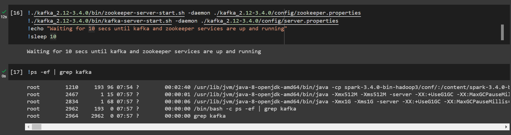

Create a topic named `tweets`.

```python
!./kafka_2.12-3.4.0/bin/kafka-topics.sh --create --bootstrap-server 127.0.0.1:9092 --replication-factor 1 --partitions 1 --topic tweets
```

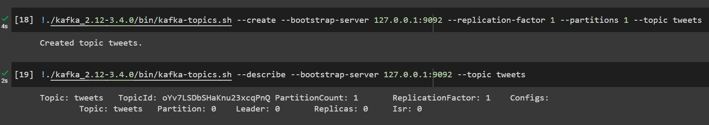

Now let's set up our Kafka producer.

```python
from kafka import KafkaProducer
import json
from bson import json_util
import threading

# Set up Kafka producer configuration
bootstrap_servers = ['localhost:9092']
producer = KafkaProducer(bootstrap_servers=bootstrap_servers, \
                         value_serializer=lambda v: json_util.dumps(v).encode('utf-8'))

# Stream data from MongoDB and push to Kafka
def push(producer, client):
  for doc in client["lab4"]["tweets"].find({}):
      producer.send('tweets', {"tweet": doc["Tweet"], "date": doc["Date"]})
      producer.flush()

p = threading.Thread(target=push, args=(producer, client, ))
p.daemon = True
```

In the code above, we have created a thread to stream data from MongoDB and push to Kafka. Why do we need to use a thread? Because the date should be pushed to Kafka and processed in parallel. Now let's see how we can consume the data from Kafka.

```python
# Define the Kafka topic to read from
KAFKA_TOPIC = "tweets"

# Create a streaming DataFrame that reads from Kafka
df = my_spark \
    .readStream \
    .format("kafka") \
    .option("kafka.bootstrap.servers", "localhost:9092") \
    .option("subscribe", KAFKA_TOPIC) \
    .option("startingOffsets", "earliest") \
    .load()
```

If we print the schema of the DataFrame, we can see that it has 7 different columns.

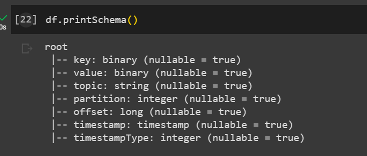

But we only need the `value` column. And in this column, we only want the `tweet` and `date` fields. So we need to extract these fields from the `value` column.

```python
from pyspark.sql.functions import from_csv, from_json, window, col, count, sum, udf, avg
from pyspark.sql.types import StringType, TimestampType, StructType, FloatType, DateType, IntegerType

schema = StructType() \
        .add("tweet", StringType()) \
        .add("date", TimestampType())

a = df.selectExpr("CAST(value AS STRING)") \
  .select(from_json("value", schema).alias("data")) \
  .select("data.*")

a.printSchema()
```

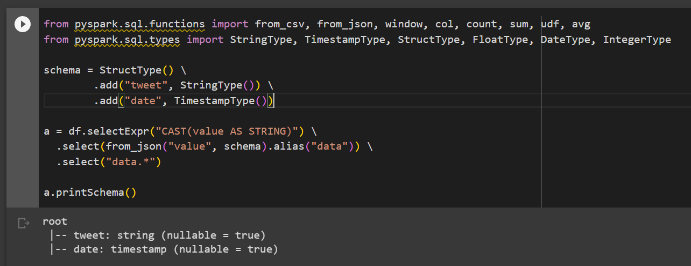

It looks good. Now let's see how we can perform sentiment analysis on the tweets. First, let's create a global dateframe to store the result.

```python
df_schema = StructType() \
            .add('date', DateType()) \
            .add('score_sum', FloatType()) \
            .add('score_count', IntegerType()) \
            .add('score_avg', FloatType())

GLOBAL_DF = my_spark.createDataFrame([], df_schema)
GLOBAL_DF.printSchema()
```

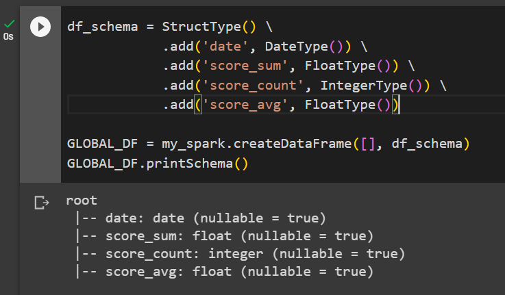

This dataframe will store the date, the sum of the scores, the number of tweets, and the average score of the tweets. Now let's create a function to perform sentiment analysis on the tweets.

```python
from textblob import TextBlob

def sentiment_analysis(text):
    return TextBlob(text).sentiment.polarity
```

We use the `textblob` library to perform sentiment analysis. Now let's create a function to process the tweets.

```python

convertUDF = udf(lambda z: sentiment_analysis(z), FloatType())

def foreach_batch_function(df, epoch_id):
    global GLOBAL_DF
    temp_df = (
        df.select(col("date"), convertUDF(col("tweet")).alias("score"))
        .groupBy(window("date", "1 day"))
        .agg(
            count("score").alias("score_count"),
            sum("score").alias("score_sum"),
            avg("score").alias("score_avg"),
        )
        .select(
            col("window").start.cast(DateType()).alias("date"),
            col("score_sum"),
            col("score_count"),
            col("score_avg"),
        )
    )
    GLOBAL_DF = (
        GLOBAL_DF.unionAll(temp_df)
        .groupBy("date")
        .agg(
            sum("score_sum").alias("score_sum"), sum("score_count").alias("score_count")
        )
        .withColumn("score_avg", col("score_sum") / col("score_count"))
        .orderBy("date")
    )
    GLOBAL_DF.show()
```

What the code does is that it takes our dataframe, performs sentiment analysis on each tweet, then group the tweets by date, and calculate the sum, count, and average of the scores. Finally, it combines the result with the global dataframe. Now we can start the stream. But wait, we also need to visualize the result. So let's install `dash` and `plotly`, or more accurately, `jupyter-dash` for Google Colab.

```python
!pip install jupyter-dash
```

Set up our dashboard.

```python
from jupyter_dash import JupyterDash
from dash import dcc, html
from dash.dependencies import Input, Output
import plotly.graph_objs as go
import random

app = JupyterDash(__name__)
app.layout = html.Div(
    [
        dcc.Graph(id="live-graph", animate=True),
        dcc.Interval(id="graph-update", interval=1 * 60000),
    ]
)

@app.callback(Output("live-graph", "figure"), [Input("graph-update", "n_intervals")])
def update_graph_scatter(input_data):
    global GLOBAL_DF
    df = GLOBAL_DF.toPandas()
    data = go.Scatter(x=df["date"], y=df["score_avg"], name="Scatter", mode="lines+markers")

    return {
        "data": [data],
        "layout": go.Layout(),
    }
```

In the code above, we have created a dashboard with a Scatter plot. The plot uses the data from the global dataframe and updates every 1 minute. Now let's actually run the job.

First, our dash server's running on port 8081 in Google Colab.

```python
app.run_server(port=8081, debug=True, mode='inline') # dash server
```

Second, our producer's thread.

```python
p.start() # producer
```

Last, our stream.

```python
query = a.writeStream.foreachBatch(foreach_batch_function).start() # consumer and analysis
query.awaitTermination(1200) # run for 20 mins
```

Here is the result.

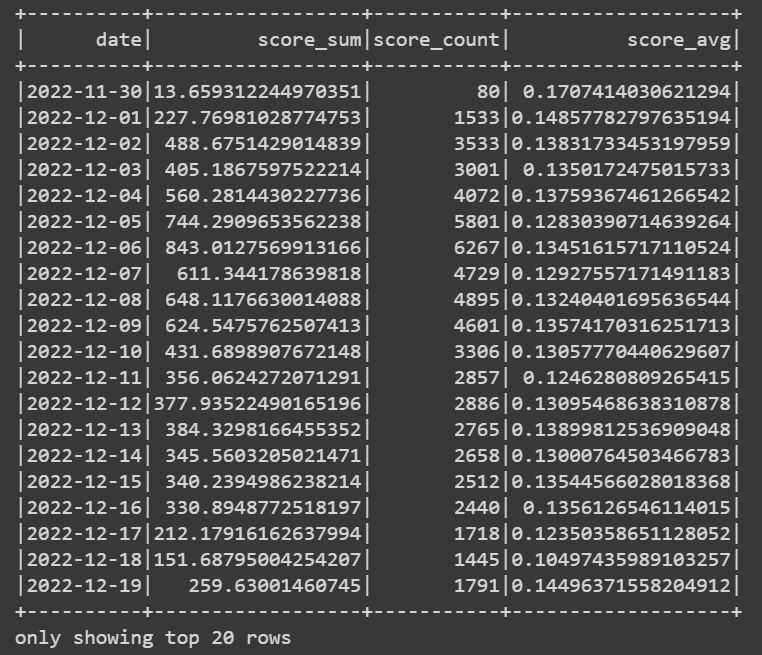

And our plot.

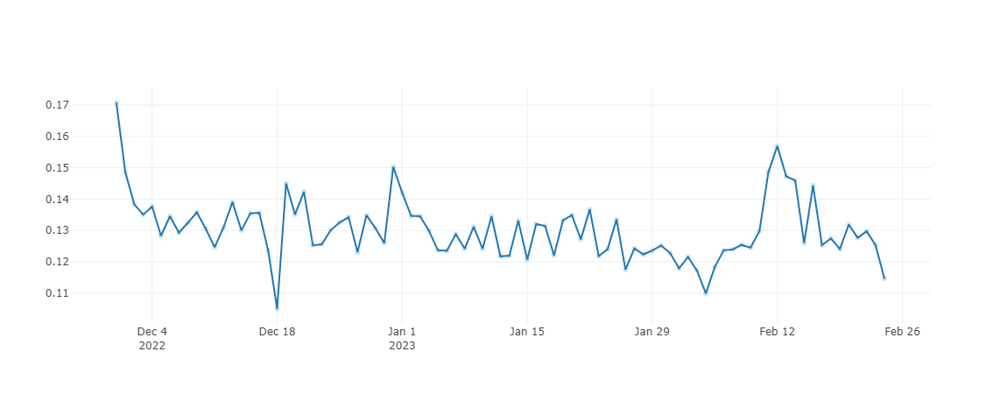

## Conclusion

### What have we learned?

- We have learned how to set up MongoDB, Kafka, and Spark.
- We have learned how to push data from MongoDB to Kafka.
- We have learned how to consume data from Kafka and perform sentiment analysis on the data.
- We have learned how to visualize the result using Dash and Plotly.

### How well did we do?

We did really well. We have completed all the requirements of the lab. Setting up the environment, getting the data, pushing the data to Kafka, consuming the data from Kafka, performing sentiment analysis on the data, and visualizing the result.

Of course, we encountered a lot of problems during the lab. We could not connect PySpark and Kafka because of the incompatible versions. We didn't know what version to choose, what packages to install. We also didn't know how to visualize the result in Google Colab. But the most difficult problem is that we didn't know how to consume the data in Kafka correctly ('cause it didn't print anything to console). We had to try a lot of different ways and finally, we found the solution.

### What could we have done better?

We could have done better if we had more time. We could have analyzed the data more efficient, and tried to visualize the result in different ways. But the main point of this lab is to learn how to use Spark to process streaming data, and we have done that. So we guess it's okay.

### Self-evaluation

Here is result that we have done in this lab:

- [100%] Get Twitter tweets
- [100%] Stream tweets to Apache Spark
- [100%] Perform sentiment analysis on the tweets
- [100%] Visualize the analytic results

## References

<!-- References without citing, this will be display as resources -->

- Kafka and Spark Streaming in Colab
  - https://colab.research.google.com/github/recohut/notebook/blob/master/_notebooks/2021-06-25-kafka-spark-streaming-colab.ipynb
- Structured Streaming Programming Guide
  - https://spark.apache.org/docs/latest/structured-streaming-programming-guide.html
- Live Graphs with Events - Data Visualization GUIs with Dash and Python
  - https://pythonprogramming.net/live-graphs-data-visualization-application-dash-python-tutorial/
- MapReduce Word Count Example
  - https://www.javatpoint.com/mapreduce-word-count-example
- Lab 3: Apache Spark with MongoDB
- All of StackOverflow link related.

<!-- References with citing, this will be display as footnotes -->
